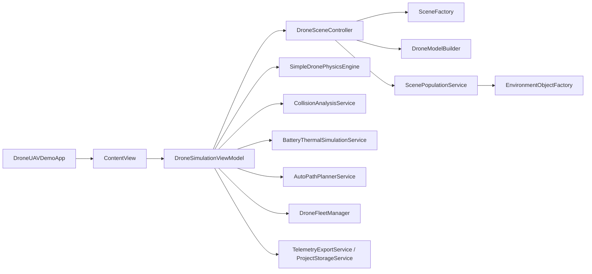

# DroneUAVDemo: структура проекта и карта компонентов

## Назначение проекта

`DroneUAVDemo` — macOS-приложение на `Swift + SwiftUI + SceneKit` для симуляции БЛА. В проекте совмещены:

- интерактивная 3D-сцена;
- упрощённая физика полёта;
- каталог БЛА и выбор активного профиля;
- модули управления полётом, камерой, сценарием, диагностикой и полезной нагрузкой;
- телеметрия, диагностика, экспорт и сохранение проектов.

Документ нужен как практическая карта кодовой базы: что лежит в какой директории, за что отвечает каждый слой и где искать нужную логику.

---

## Быстрый маршрут по коду

Если нужно быстро понять проект, читайте в таком порядке:

1. [DroneUAVDemoApp.swift](/Users/misha/Documents/New%20project/DroneUAVDemo/DroneUAVDemoApp.swift)  
   Точка входа приложения.
2. [ContentView.swift](/Users/misha/Documents/New%20project/DroneUAVDemo/Presentation/Views/ContentView.swift)  
   Верхнеуровневый shell приложения, стартовый экран и рабочее окно симуляции.
3. [DroneSimulationViewModel.swift](/Users/misha/Documents/New%20project/DroneUAVDemo/Presentation/ViewModels/DroneSimulationViewModel.swift)  
   Главный orchestrator: состояние, цикл симуляции, связь UI со сценой и сервисами.
4. [DroneSceneController.swift](/Users/misha/Documents/New%20project/DroneUAVDemo/Scene/DroneSceneController.swift)  
   Управляет `SceneKit`-сценой, камерой, визуальной моделью дрона, окружением и debug-слоями.
5. [SimpleDronePhysicsEngine.swift](/Users/misha/Documents/New%20project/DroneUAVDemo/Simulation/SimpleDronePhysicsEngine.swift)  
   Основная baseline-физика полёта.
6. [ScenePopulationService.swift](/Users/misha/Documents/New%20project/DroneUAVDemo/Scene/ScenePopulationService.swift)  
   Генерирует окружение по типу местности.
7. [TelemetryExportService.swift](/Users/misha/Documents/New%20project/DroneUAVDemo/Services/TelemetryExportService.swift)  
   Экспорт телеметрии и хранение проектов.

---

## Общая архитектура

Проект разбит на несколько слоёв:

- `Presentation`  
  SwiftUI-интерфейс, модульная левая панель, overlay-панели, shell приложения.
- `ViewModel`  
  Главный runtime state и orchestration.
- `Scene`  
  Построение и обновление `SceneKit`-сцены.
- `Simulation`  
  Физика полёта, анализ коллизий, автопланирование, батарея/тепло, флот, payload-логика.
- `Domain`  
  Чистые модели данных и конфигурации.
- `Services`  
  Работа с проектами, autosave, внутренним storage и экспортом телеметрии.
- `Input`  
  Клавиатурный ввод и бинды.
- `Resources` / `Assets`  
  Локализация и визуальные ассеты.

Упрощённая схема потока:

---

## Как запускается приложение

### 1. Точка входа

[DroneUAVDemoApp.swift](/Users/misha/Documents/New%20project/DroneUAVDemo/DroneUAVDemoApp.swift)

- создаёт `WindowGroup`;
- показывает `ContentView`;
- задаёт стартовый размер окна;
- добавляет команду fullscreen.

### 2. Shell приложения

[ContentView.swift](/Users/misha/Documents/New%20project/DroneUAVDemo/Presentation/Views/ContentView.swift)

Файл выполняет сразу две роли:

- стартовый экран со списком проектов;
- рабочее окно симуляции после открытия/создания проекта.

Внутри него есть `AppShellViewModel`, который отвечает за:

- список сохранённых проектов;
- открытие/создание/дублирование/удаление проекта;
- показ активной симуляции;
- обработку сценария выхода с несохранёнными изменениями.

Когда проект открыт, `ContentView` строит рабочую компоновку:

- верхняя строка состояния проекта;
- toolbar-модули (`Flight Ops`, `UAV Catalog`, `Camera`, `Scenario`, `Diagnostics`, `Payload`);
- левая модульная панель;
- центральный viewport со сценой;
- overlay для payload и сигналов потери связи.

---

## Главный runtime-узел

### DroneSimulationViewModel

[DroneSimulationViewModel.swift](/Users/misha/Documents/New%20project/DroneUAVDemo/Presentation/ViewModels/DroneSimulationViewModel.swift)

Это главный координационный объект проекта. Он:

- хранит всё текущее состояние симуляции;
- владеет сценой через `DroneSceneController`;
- создаёт и использует все runtime-сервисы;
- запускает таймер симуляции;
- связывает UI-команды с физикой и сценой;
- публикует телеметрию, предупреждения и диагностику для SwiftUI.

### Что именно хранит `ViewModel`

Основные группы состояния:

- управление:
  - `controlValues`
  - `mode`
  - `flightControlMode`
  - `isArmed`
  - `physicalState`
- проект:
  - `currentProjectID`
  - `currentProjectName`
  - `hasUnsavedChanges`
- каталог БЛА:
  - `availableDroneProfiles`
  - `selectedDroneProfile`
  - `activeUAVProfile`
  - `uavCatalogFilterState`
  - `abstractParameters`
- окружение и камера:
  - `weather`
  - `terrain`
  - `cameraConfiguration`
  - `selectedCameraPreset`
- эксплуатация:
  - `payloadState`
  - `payloadMountState`
  - `payloadDraftConfiguration`
  - `vehicleMassModel`
  - `payloadCapabilityCheck`
- runtime-сигналы:
  - `telemetry`
  - `warnings`
  - `diagnostics`
  - `collisionAnalysis`
  - `batteryState`
  - `damageState`
  - `thermalState`
  - `fleetStatus`
- UI-состояние:
  - `isToolPanelVisible`
  - `isParametersPanelVisible`
  - `activeControlModule`
  - `isPayloadPanelVisible`
  - `collisionDebugEnabled`
  - `diagnosticMode`
  - `isCompactTelemetryHUDEnabled`

### Какие сервисы создаёт `ViewModel`

В конструкторе `DroneSimulationViewModel` подключаются:

- `SimpleDronePhysicsEngine`
- `KeyboardInputService`
- `CollisionAnalysisService`
- `BatteryThermalSimulationService`
- `TelemetryExportService`
- `ProjectStorageService`
- `DroneFleetManager`
- `AutoPathPlannerService`
- `DroneSceneController`

То есть `ViewModel` — это место, где сходятся все крупные подсистемы проекта.

---

## Как работает цикл симуляции

### Таймер

`DroneSimulationViewModel.startSimulationLoop()` запускает `Timer` с частотой `1/45` секунды.

### Кадр симуляции

Каждый кадр проходит через `tick()`.

Упрощённый порядок:

1. снять `dt`;
2. обработать keyboard input;
3. обновить цели автопилота;
4. пересчитать collision risk;
5. собрать `DroneControlInput`;
6. собрать `DroneSimulationContext`;
7. передать всё в `physicsEngine.step(...)`;
8. применить runtime safety и state transitions;
9. обновить батарею и thermal model;
10. обновить сцену через `sceneController.update(...)`;
11. обновить debug visualisation;
12. пересчитать diagnostics;
13. опубликовать HUD/telemetry;
14. выполнить autosave / экспортные накопления, если требуется.

Это ключевая точка проекта. Если нужно понять поведение дрона, почти всегда нужно смотреть именно `tick()`.

---

## Структура директорий

## `/DroneUAVDemo`

Корень app-target. Здесь лежит entry point и все основные слои.

### Ключевые файлы

- [DroneUAVDemoApp.swift](/Users/misha/Documents/New%20project/DroneUAVDemo/DroneUAVDemoApp.swift)  
  entry point macOS-приложения.
- [PROJECT_STRUCTURE_RU.md](/Users/misha/Documents/New%20project/DroneUAVDemo/PROJECT_STRUCTURE_RU.md)  
  этот документ.

---

## `/DroneUAVDemo/Presentation`

Слой интерфейса на SwiftUI.

### `/Presentation/ViewModels`

- [DroneSimulationViewModel.swift](/Users/misha/Documents/New%20project/DroneUAVDemo/Presentation/ViewModels/DroneSimulationViewModel.swift)  
  единый runtime-viewmodel приложения. Главное место, где соединяются UI, физика, сцена, диагностика, payload, автопилот и хранение проекта.

### `/Presentation/Views`

Тут лежат все SwiftUI-экраны и модульные панели.

#### Каркас и компоновка

- [ContentView.swift](/Users/misha/Documents/New%20project/DroneUAVDemo/Presentation/Views/ContentView.swift)  
  shell приложения: стартовый экран, toolbar, панель модулей, viewport, payload overlay.
- [SceneViewportView.swift](/Users/misha/Documents/New%20project/DroneUAVDemo/Presentation/Views/SceneViewportView.swift)  
  центральная область со сценой и telemetry HUD.
- [DroneSceneViewRepresentable.swift](/Users/misha/Documents/New%20project/DroneUAVDemo/Presentation/Views/DroneSceneViewRepresentable.swift)  
  мост SwiftUI -> `SCNView`; управляет камерой, mouse-look и free-camera control.
- [SidebarModuleHostView.swift](/Users/misha/Documents/New%20project/DroneUAVDemo/Presentation/Views/SidebarModuleHostView.swift)  
  host левой панели: показывает только активный модуль.
- [ControlModule.swift](/Users/misha/Documents/New%20project/DroneUAVDemo/Presentation/Views/ControlModule.swift)  
  enum модулей: `flightOps`, `uavCatalog`, `camera`, `scenario`, `diagnostics`.

#### Модульные панели

- [FlightOpsModuleView.swift](/Users/misha/Documents/New%20project/DroneUAVDemo/Presentation/Views/FlightOpsModuleView.swift)  
  действия полёта: arm/disarm, takeoff, hover, land, return home, auto path, throttle, control law.
- [UAVCatalogModuleView.swift](/Users/misha/Documents/New%20project/DroneUAVDemo/Presentation/Views/UAVCatalogModuleView.swift)  
  выбор платформы, фильтры, открытие редактора abstract-модели.
- [CameraModuleView.swift](/Users/misha/Documents/New%20project/DroneUAVDemo/Presentation/Views/CameraModuleView.swift)  
  режимы камеры, presets, optics и advanced controls.
- [ScenarioModuleView.swift](/Users/misha/Documents/New%20project/DroneUAVDemo/Presentation/Views/ScenarioModuleView.swift)  
  погода, ветер, карта, плотность окружения, boundary visibility.
- [DiagnosticsModuleView.swift](/Users/misha/Documents/New%20project/DroneUAVDemo/Presentation/Views/DiagnosticsModuleView.swift)  
  диагностика: overview, telemetry, fleet, service.
- [PayloadView.swift](/Users/misha/Documents/New%20project/DroneUAVDemo/Presentation/Views/PayloadView.swift)  
  отдельный overlay-модуль payload system.

#### Вспомогательные панели и элементы

- [CompactTelemetryHUDView.swift](/Users/misha/Documents/New%20project/DroneUAVDemo/Presentation/Views/CompactTelemetryHUDView.swift)  
  компактный HUD поверх сцены.
- [TelemetryPanelView.swift](/Users/misha/Documents/New%20project/DroneUAVDemo/Presentation/Views/TelemetryPanelView.swift)  
  развернутый telemetry block внутри diagnostics.
- [PayloadToolbarEntry.swift](/Users/misha/Documents/New%20project/DroneUAVDemo/Presentation/Views/PayloadToolbarEntry.swift)  
  кнопка payload в верхнем toolstrip.
- [KeyBindingsSettingsView.swift](/Users/misha/Documents/New%20project/DroneUAVDemo/Presentation/Views/KeyBindingsSettingsView.swift)  
  настройки биндов.
- [AbstractModelEditorView.swift](/Users/misha/Documents/New%20project/DroneUAVDemo/Presentation/Views/AbstractModelEditorView.swift)  
  редактор кастомной абстрактной модели БЛА.
- [UAVCatalogView.swift](/Users/misha/Documents/New%20project/DroneUAVDemo/Presentation/Views/UAVCatalogView.swift)  
  список БЛА внутри каталога.
- [UAVFilterBarView.swift](/Users/misha/Documents/New%20project/DroneUAVDemo/Presentation/Views/UAVFilterBarView.swift)  
  фильтры каталога.
- [UAVProfileCardView.swift](/Users/misha/Documents/New%20project/DroneUAVDemo/Presentation/Views/UAVProfileCardView.swift)  
  карточка профиля БЛА.

#### Legacy / compatibility

- [ControlPanelView.swift](/Users/misha/Documents/New%20project/DroneUAVDemo/Presentation/Views/ControlPanelView.swift)  
  старая длинная панель управления. Сейчас архитектурно важнее toolbar-driven modules, но файл может оставаться как legacy-reference/compatibility code.

---

## `/DroneUAVDemo/Domain`

Чистые модели предметной области. Здесь нет `SceneKit`-сцены и почти нет UI.

### Что здесь лежит

- профили БЛА:
  - [DroneModelProfile.swift](/Users/misha/Documents/New%20project/DroneUAVDemo/Domain/DroneModelProfile.swift)
  - [UAVProfile.swift](/Users/misha/Documents/New%20project/DroneUAVDemo/Domain/UAVProfile.swift)
  - [UAVReferenceCatalog.swift](/Users/misha/Documents/New%20project/DroneUAVDemo/Domain/UAVReferenceCatalog.swift)
  - [UAVCatalog.swift](/Users/misha/Documents/New%20project/DroneUAVDemo/Domain/UAVCatalog.swift)
- управление и состояние полёта:
  - [DroneState.swift](/Users/misha/Documents/New%20project/DroneUAVDemo/Domain/DroneState.swift)
  - [DroneControlInput.swift](/Users/misha/Documents/New%20project/DroneUAVDemo/Domain/DroneControlInput.swift)
  - [DroneControlValues.swift](/Users/misha/Documents/New%20project/DroneUAVDemo/Domain/DroneControlValues.swift)
  - [DroneFlightMode.swift](/Users/misha/Documents/New%20project/DroneUAVDemo/Domain/DroneFlightMode.swift)
- камера:
  - [CameraConfiguration.swift](/Users/misha/Documents/New%20project/DroneUAVDemo/Domain/CameraConfiguration.swift)
- окружение:
  - [WeatherModel.swift](/Users/misha/Documents/New%20project/DroneUAVDemo/Domain/WeatherModel.swift)
  - [TerrainModel.swift](/Users/misha/Documents/New%20project/DroneUAVDemo/Domain/TerrainModel.swift)
- телеметрия и диагностика:
  - [TelemetrySnapshot.swift](/Users/misha/Documents/New%20project/DroneUAVDemo/Domain/TelemetrySnapshot.swift)
  - [CollisionAnalysis.swift](/Users/misha/Documents/New%20project/DroneUAVDemo/Domain/CollisionAnalysis.swift)
  - [DamageThermalModel.swift](/Users/misha/Documents/New%20project/DroneUAVDemo/Domain/DamageThermalModel.swift)
  - [BatteryState.swift](/Users/misha/Documents/New%20project/DroneUAVDemo/Domain/BatteryState.swift)
- fleet / formation:
  - [DroneFleetModel.swift](/Users/misha/Documents/New%20project/DroneUAVDemo/Domain/DroneFleetModel.swift)
- payload:
  - [PayloadConfiguration.swift](/Users/misha/Documents/New%20project/DroneUAVDemo/Domain/PayloadConfiguration.swift)
  - [PayloadType.swift](/Users/misha/Documents/New%20project/DroneUAVDemo/Domain/PayloadType.swift)
  - [PayloadState.swift](/Users/misha/Documents/New%20project/DroneUAVDemo/Domain/PayloadState.swift)
  - [PayloadMountState.swift](/Users/misha/Documents/New%20project/DroneUAVDemo/Domain/PayloadMountState.swift)
  - [PayloadCapabilityCheck.swift](/Users/misha/Documents/New%20project/DroneUAVDemo/Domain/PayloadCapabilityCheck.swift)
  - [PayloadDataQualitySource.swift](/Users/misha/Documents/New%20project/DroneUAVDemo/Domain/PayloadDataQualitySource.swift)
  - [PayloadVisualPreset.swift](/Users/misha/Documents/New%20project/DroneUAVDemo/Domain/PayloadVisualPreset.swift)
  - [VehicleMassModel.swift](/Users/misha/Documents/New%20project/DroneUAVDemo/Domain/VehicleMassModel.swift)
- фильтры и UI-facing состояния каталога:
  - [UAVFilterState.swift](/Users/misha/Documents/New%20project/DroneUAVDemo/Domain/UAVFilterState.swift)
  - [UAVSelectionState.swift](/Users/misha/Documents/New%20project/DroneUAVDemo/Domain/UAVSelectionState.swift)
  - [UAVVehicleType.swift](/Users/misha/Documents/New%20project/DroneUAVDemo/Domain/UAVVehicleType.swift)
  - [UAVMassCategory.swift](/Users/misha/Documents/New%20project/DroneUAVDemo/Domain/UAVMassCategory.swift)

### На что обратить внимание

- [DroneModelProfile.swift](/Users/misha/Documents/New%20project/DroneUAVDemo/Domain/DroneModelProfile.swift) — один из самых важных domain-файлов:
  - описывает `DroneModelProfile`;
  - содержит `AbstractDroneParameters`;
  - хранит `LIPODroneModelRepository`, который отдаёт baseline-набор профилей.
- [TerrainModel.swift](/Users/misha/Documents/New%20project/DroneUAVDemo/Domain/TerrainModel.swift) — задаёт `TerrainPreset`, `MapScale`, `TerrainConfiguration`, `EnvironmentObjectKind`.
- [WeatherModel.swift](/Users/misha/Documents/New%20project/DroneUAVDemo/Domain/WeatherModel.swift) — описывает пресеты погоды и превращает их в runtime-факторы, влияющие на физику и риск.

---

## `/DroneUAVDemo/Scene`

Слой сцены и визуализации на `SceneKit`.

### Основные файлы

- [DroneSceneController.swift](/Users/misha/Documents/New%20project/DroneUAVDemo/Scene/DroneSceneController.swift)  
  главный контроллер сцены. Отвечает за:
  - корневую `SCNScene`;
  - камеры;
  - ноду БЛА и её визуал;
  - weather FX;
  - dock station;
  - world bounds;
  - окружение;
  - collision debug;
  - path debug;
  - dropped payload visuals;
  - обновление сцены на каждом кадре.

- [SceneFactory.swift](/Users/misha/Documents/New%20project/DroneUAVDemo/Scene/SceneFactory.swift)  
  создаёт базовую пустую сцену: ground plane, lights, grid, axes, camera.

- [DroneModelBuilder.swift](/Users/misha/Documents/New%20project/DroneUAVDemo/Scene/DroneModelBuilder.swift)  
  собирает визуальную модель БЛА и отдаёт связанный набор anchor-нод:
  - `visualRootNode`
  - `cameraAnchorNode`
  - `groundReferenceNode`
  - `fpvAnchorNode`
  - `payloadMountNode`
  - `propellerNodes`

- [UAVVisualFactory.swift](/Users/misha/Documents/New%20project/DroneUAVDemo/Scene/UAVVisualFactory.swift)  
  фабрика визуальных вариантов БЛА.

- [FPVCameraAnchor.swift](/Users/misha/Documents/New%20project/DroneUAVDemo/Scene/FPVCameraAnchor.swift)  
  конфигурация FPV-привязки.

- [PayloadVisualFactory.swift](/Users/misha/Documents/New%20project/DroneUAVDemo/Scene/PayloadVisualFactory.swift)  
  визуальные модели payload.

- [ScenePopulationService.swift](/Users/misha/Documents/New%20project/DroneUAVDemo/Scene/ScenePopulationService.swift)  
  генерирует объекты окружения по preset местности.

- [EnvironmentObjectFactory.swift](/Users/misha/Documents/New%20project/DroneUAVDemo/Scene/EnvironmentObjectFactory.swift)  
  строит `SCNNode` для объекта окружения по `EnvironmentObjectDescriptor`.

### Что происходит в сцене

Когда `ViewModel` вызывает `sceneController.regenerateEnvironment(terrain)`, происходит:

1. выбор пресета местности;
2. генерация descriptor-ов объектов через `ScenePopulationService`;
3. создание реальных `SCNNode` через `EnvironmentObjectFactory`;
4. установка boundary/dock/world visuals;
5. обновление obstacle-набора для collision logic и debug.

---

## `/DroneUAVDemo/Simulation`

Отдельный слой логики симуляции без SwiftUI.

### Основные файлы

- [DronePhysicsEngine.swift](/Users/misha/Documents/New%20project/DroneUAVDemo/Simulation/DronePhysicsEngine.swift)  
  протокол движка физики.

- [SimpleDronePhysicsEngine.swift](/Users/misha/Documents/New%20project/DroneUAVDemo/Simulation/SimpleDronePhysicsEngine.swift)  
  baseline-физика полёта:
  - step с фиксированным substep;
  - multirotor/fixed-wing ветки;
  - thrust, gravity, drag, wind;
  - rate control;
  - ground rest behavior.

- [DroneSimulationContext.swift](/Users/misha/Documents/New%20project/DroneUAVDemo/Simulation/DroneSimulationContext.swift)  
  входной контекст для физики:
  - профиль;
  - активный `UAVProfile`;
  - погода;
  - damage/battery;
  - collision risk;
  - wind vector;
  - mass model.

- [CollisionAnalysisService.swift](/Users/misha/Documents/New%20project/DroneUAVDemo/Simulation/CollisionAnalysisService.swift)  
  считает риск столкновения и ближайшее препятствие.

- [AutoPathPlannerService.swift](/Users/misha/Documents/New%20project/DroneUAVDemo/Simulation/AutoPathPlannerService.swift)  
  планировщик маршрута:
  - строит навигационную сетку;
  - помечает blocked/penalty зоны;
  - выдаёт waypoints;
  - умеет invalidate и replan.

- [BatteryThermalSimulationService.swift](/Users/misha/Documents/New%20project/DroneUAVDemo/Simulation/BatteryThermalSimulationService.swift)  
  расчёт разряда батареи и thermal state.

- [DroneFleetManager.swift](/Users/misha/Documents/New%20project/DroneUAVDemo/Simulation/DroneFleetManager.swift)  
  логика ведомых БЛА, их формаций и междроновых рисков.

- [PayloadController.swift](/Users/misha/Documents/New%20project/DroneUAVDemo/Simulation/PayloadController.swift)  
  payload capability check и mass model с учётом полезной нагрузки.

- [FlightBaselineResolver.swift](/Users/misha/Documents/New%20project/DroneUAVDemo/Simulation/FlightBaselineResolver.swift)  
  резолвит baseline-параметры полёта из runtime profile и active UAV profile.

### Когда менять этот слой

- изменить поведение полёта -> `SimpleDronePhysicsEngine`
- изменить collision risk / avoidance -> `CollisionAnalysisService`
- изменить авто-маршрут -> `AutoPathPlannerService`
- изменить батарею/нагрев -> `BatteryThermalSimulationService`
- изменить логику payload mass -> `PayloadController`
- изменить wingmen/fleet -> `DroneFleetManager`

---

## `/DroneUAVDemo/Services`

Инфраструктурные сервисы хранения и экспорта.

### [TelemetryExportService.swift](/Users/misha/Documents/New%20project/DroneUAVDemo/Services/TelemetryExportService.swift)

Файл шире, чем подсказывает имя. В нём лежат:

- `InternalStorePaths`
- `ProjectRecordSummary`
- `ProjectSnapshot`
- `ProjectStorageManaging`
- `ProjectStorageService`
- `TelemetryExportService`

То есть это одновременно:

- экспорт телеметрии;
- внутренняя файловая структура приложения;
- сохранение проекта;
- загрузка проекта;
- autosave;
- project index.

### Где физически лежат данные

Внутренний storage создаётся в:

- `Application Support/DroneUAVDemo/InternalStore/Projects`
- `Application Support/DroneUAVDemo/InternalStore/Autosaves`
- `Application Support/DroneUAVDemo/InternalStore/Telemetry`
- `Application Support/DroneUAVDemo/InternalStore/Index`

Если проект нужно переносить или разбирать сохранения руками, это ключевое место.

---

## `/DroneUAVDemo/Input`

### [KeyboardInputService.swift](/Users/misha/Documents/New%20project/DroneUAVDemo/Input/KeyboardInputService.swift)

Сервис клавиатуры. Здесь живут:

- осевые input-структуры:
  - `KeyboardAxisInput`
  - `KeyboardYawInput`
  - `KeyboardLookInput`
- категории биндов:
  - `flight`
  - `camera`
  - `ui`
  - `debug`
- `KeyboardCommand`
- `KeyBindingDescriptor`
- `KeyBindingProfile.default`

Сюда смотреть, если нужно:

- поменять стандартные клавиши;
- добавить новую команду;
- разделить UI-команды и flight-команды;
- диагностировать конфликты биндов.

---

## `/DroneUAVDemo/Resources`

Локализация и Xcode asset catalog.

### Подкаталоги

- [Resources/en.lproj/Localizable.strings](/Users/misha/Documents/New%20project/DroneUAVDemo/Resources/en.lproj/Localizable.strings)  
  английская локализация.
- [Resources/ru.lproj/Localizable.strings](/Users/misha/Documents/New%20project/DroneUAVDemo/Resources/ru.lproj/Localizable.strings)  
  русская локализация.
- [Resources/Assets.xcassets](/Users/misha/Documents/New%20project/DroneUAVDemo/Resources/Assets.xcassets/Contents.json)  
  app icons и другие системные ассеты Xcode.

---

## `/DroneUAVDemo/Assets`

Нестандартные визуальные ассеты проекта.

### Структура

- `/Assets/Buildings`
- `/Assets/Dock`
- `/Assets/Terrain`
- `/Assets/Terrain/Asphalt`
- `/Assets/Terrain/Forest`
- `/Assets/Terrain/Ground`
- `/Assets/Trees`
- `/Assets/Trees/Bark`
- `/Assets/Trees/Leaves`
- `/Assets/Trees/Models`
- `/Assets/UI`

### Что здесь обычно искать

- текстуры земли и покрытия;
- исходники/варианты деревьев;
- модели и материалы окружения;
- ассеты dock station;
- дополнительные UI-материалы.

---

## Как устроен UI сейчас

Проект уже переведён на toolbar-driven modules.

### Верхняя панель

`SimulationToolstripView` в [ContentView.swift](/Users/misha/Documents/New%20project/DroneUAVDemo/Presentation/Views/ContentView.swift) показывает кнопки модулей:

- `Полет`
- `БЛА`
- `Камера`
- `Сценарий`
- `Диагностика`
- `ПН`

Нажатие меняет `activeControlModule`.

### Левая панель

[SidebarModuleHostView.swift](/Users/misha/Documents/New%20project/DroneUAVDemo/Presentation/Views/SidebarModuleHostView.swift)

Показывает только активный модуль:

- `FlightOpsModuleView`
- `UAVCatalogModuleView`
- `CameraModuleView`
- `ScenarioModuleView`
- `DiagnosticsModuleView`

`PayloadView` не живёт в левой панели, а открывается как отдельный overlay.

### Центральная область

[SceneViewportView.swift](/Users/misha/Documents/New%20project/DroneUAVDemo/Presentation/Views/SceneViewportView.swift)

Содержит:

- `DroneSceneViewRepresentable` с `SCNView`;
- компактный telemetry HUD или компактную текстовую шапку в зависимости от состояния панели.

---

## Как связаны UI и сцена

### Главный принцип

`SwiftUI` не управляет `SceneKit` напрямую. Всё идёт через `DroneSimulationViewModel`.

Связь выглядит так:

- UI вызывает метод `viewModel`;
- `viewModel` меняет domain/runtime state;
- `viewModel` на тике вызывает `sceneController.update(...)`;
- `sceneController` синхронизирует `SCNNode`-дерево со state;
- `SceneViewportView` просто показывает уже обновлённую сцену.

Это важное правило проекта: не писать сценовую бизнес-логику напрямую во view.

---

## Как работает создание и выбор БЛА

### Базовый путь

1. `DroneSimulationViewModel` создаёт `LIPODroneModelRepository`.
2. Из него получает `availableDroneProfiles` и `defaultProfile`.
3. По выбранному runtime profile резолвится `activeUAVProfile`.
4. `DroneSceneController` строит визуал БЛА через `DroneModelBuilder`.
5. Физика и mass model используют `selectedDroneProfile + activeUAVProfile + payload`.

### Где править каталог

- runtime flight/visual profile -> [DroneModelProfile.swift](/Users/misha/Documents/New%20project/DroneUAVDemo/Domain/DroneModelProfile.swift)
- reference UAV data -> [UAVReferenceCatalog.swift](/Users/misha/Documents/New%20project/DroneUAVDemo/Domain/UAVReferenceCatalog.swift)
- фильтрация и selection state -> [UAVCatalog.swift](/Users/misha/Documents/New%20project/DroneUAVDemo/Domain/UAVCatalog.swift), [UAVFilterState.swift](/Users/misha/Documents/New%20project/DroneUAVDemo/Domain/UAVFilterState.swift)
- UI каталога -> [UAVCatalogModuleView.swift](/Users/misha/Documents/New%20project/DroneUAVDemo/Presentation/Views/UAVCatalogModuleView.swift), [UAVCatalogView.swift](/Users/misha/Documents/New%20project/DroneUAVDemo/Presentation/Views/UAVCatalogView.swift)

---

## Как работает окружение

### Генерация

[ScenePopulationService.swift](/Users/misha/Documents/New%20project/DroneUAVDemo/Scene/ScenePopulationService.swift)

По `TerrainConfiguration` генерирует descriptor-ы для:

- `gridDemo`
- `field`
- `forest`
- `city`

Типы объектов:

- `tree`
- `building`
- `pole`
- `crate`
- `rock`
- `marker`
- `distantBelt`

### Визуализация

[EnvironmentObjectFactory.swift](/Users/misha/Documents/New%20project/DroneUAVDemo/Scene/EnvironmentObjectFactory.swift)

Преобразует descriptor в `SCNNode`.

### Collision и navigation

`DroneSceneController` хранит `environmentObstacles`, а `CollisionAnalysisService` и `AutoPathPlannerService` используют их как вход.

---

## Как работает payload system

### Данные

- [PayloadConfiguration.swift](/Users/misha/Documents/New%20project/DroneUAVDemo/Domain/PayloadConfiguration.swift)
- [PayloadType.swift](/Users/misha/Documents/New%20project/DroneUAVDemo/Domain/PayloadType.swift)
- [PayloadState.swift](/Users/misha/Documents/New%20project/DroneUAVDemo/Domain/PayloadState.swift)
- [PayloadCapabilityCheck.swift](/Users/misha/Documents/New%20project/DroneUAVDemo/Domain/PayloadCapabilityCheck.swift)
- [VehicleMassModel.swift](/Users/misha/Documents/New%20project/DroneUAVDemo/Domain/VehicleMassModel.swift)

### Логика

[PayloadController.swift](/Users/misha/Documents/New%20project/DroneUAVDemo/Simulation/PayloadController.swift)

Здесь считается:

- допустимость payload;
- ограничения по массе;
- итоговая масса аппарата.

### Визуал

[PayloadVisualFactory.swift](/Users/misha/Documents/New%20project/DroneUAVDemo/Scene/PayloadVisualFactory.swift)

### UI

[PayloadView.swift](/Users/misha/Documents/New%20project/DroneUAVDemo/Presentation/Views/PayloadView.swift)

---

## Как работает диагностика

### Runtime-диагностика

`DroneSimulationViewModel` публикует:

- `warnings`
- `diagnostics`
- `lastCollisionSource`
- `collisionAnalysis`
- `batteryState`
- `damageState`
- `thermalState`

### Scene diagnostics

`DroneSceneController.sceneDiagnostics()` отдаёт статистику сцены, которую `ViewModel` переносит в `SimulationDiagnostics`.

### UI-диагностика

[DiagnosticsModuleView.swift](/Users/misha/Documents/New%20project/DroneUAVDemo/Presentation/Views/DiagnosticsModuleView.swift)

Разбита на панели:

- `overview`
- `telemetry`
- `fleet`
- `service`

---

## Где менять что

### Если нужно поменять…

- логику взлёта/посадки/управления  
  -> [DroneSimulationViewModel.swift](/Users/misha/Documents/New%20project/DroneUAVDemo/Presentation/ViewModels/DroneSimulationViewModel.swift), [SimpleDronePhysicsEngine.swift](/Users/misha/Documents/New%20project/DroneUAVDemo/Simulation/SimpleDronePhysicsEngine.swift)

- параметры и модели БЛА  
  -> [DroneModelProfile.swift](/Users/misha/Documents/New%20project/DroneUAVDemo/Domain/DroneModelProfile.swift), [UAVReferenceCatalog.swift](/Users/misha/Documents/New%20project/DroneUAVDemo/Domain/UAVReferenceCatalog.swift)

- каталог БЛА и фильтры  
  -> [UAVCatalogModuleView.swift](/Users/misha/Documents/New%20project/DroneUAVDemo/Presentation/Views/UAVCatalogModuleView.swift), [UAVCatalogView.swift](/Users/misha/Documents/New%20project/DroneUAVDemo/Presentation/Views/UAVCatalogView.swift), [UAVFilterState.swift](/Users/misha/Documents/New%20project/DroneUAVDemo/Domain/UAVFilterState.swift)

- поведение камеры  
  -> [CameraConfiguration.swift](/Users/misha/Documents/New%20project/DroneUAVDemo/Domain/CameraConfiguration.swift), [CameraModuleView.swift](/Users/misha/Documents/New%20project/DroneUAVDemo/Presentation/Views/CameraModuleView.swift), [DroneSceneController.swift](/Users/misha/Documents/New%20project/DroneUAVDemo/Scene/DroneSceneController.swift)

- генерацию мира  
  -> [TerrainModel.swift](/Users/misha/Documents/New%20project/DroneUAVDemo/Domain/TerrainModel.swift), [ScenePopulationService.swift](/Users/misha/Documents/New%20project/DroneUAVDemo/Scene/ScenePopulationService.swift), [EnvironmentObjectFactory.swift](/Users/misha/Documents/New%20project/DroneUAVDemo/Scene/EnvironmentObjectFactory.swift)

- collision risk / obstacle avoidance / pathfinding  
  -> [CollisionAnalysisService.swift](/Users/misha/Documents/New%20project/DroneUAVDemo/Simulation/CollisionAnalysisService.swift), [AutoPathPlannerService.swift](/Users/misha/Documents/New%20project/DroneUAVDemo/Simulation/AutoPathPlannerService.swift), [DroneSceneController.swift](/Users/misha/Documents/New%20project/DroneUAVDemo/Scene/DroneSceneController.swift)

- payload  
  -> [PayloadController.swift](/Users/misha/Documents/New%20project/DroneUAVDemo/Simulation/PayloadController.swift), [PayloadView.swift](/Users/misha/Documents/New%20project/DroneUAVDemo/Presentation/Views/PayloadView.swift), [PayloadVisualFactory.swift](/Users/misha/Documents/New%20project/DroneUAVDemo/Scene/PayloadVisualFactory.swift)

- telemetry export / save-load  
  -> [TelemetryExportService.swift](/Users/misha/Documents/New%20project/DroneUAVDemo/Services/TelemetryExportService.swift)

- keybindings  
  -> [KeyboardInputService.swift](/Users/misha/Documents/New%20project/DroneUAVDemo/Input/KeyboardInputService.swift), [KeyBindingsSettingsView.swift](/Users/misha/Documents/New%20project/DroneUAVDemo/Presentation/Views/KeyBindingsSettingsView.swift)

---

## На что обратить внимание при изменениях

### 1. `DroneSimulationViewModel` очень центральный

Это полезно для понимания проекта, но делает файл большим. Любое изменение в поведении симуляции обычно проходит через него.

### 2. `TelemetryExportService.swift` содержит не только экспорт

Там же находится project storage. Не стоит ориентироваться только на имя файла.

### 3. UI уже модульный

Актуальная архитектура — toolbar-driven modules. Если править интерфейс, лучше расширять:

- `ControlModule`
- `SidebarModuleHostView`
- отдельные `*ModuleView`

а не возвращаться к старой длинной `ControlPanelView`.

### 4. SceneKit-логика отделена от SwiftUI

Визуальные изменения сцены лучше вносить в `Scene`-слой, а не прямо в SwiftUI view.

---

## Краткое резюме по слоям

- `DroneUAVDemoApp.swift`  
  запускает окно.
- `ContentView.swift`  
  shell приложения, стартовый экран и рабочая компоновка.
- `DroneSimulationViewModel.swift`  
  главный runtime state и orchestration.
- `Scene/*`  
  вся `SceneKit`-сцена, дрон, камеры, окружение, payload visual.
- `Simulation/*`  
  физика, collision analysis, автопуть, батарея/тепло, fleet, payload math.
- `Domain/*`  
  чистые модели данных.
- `Services/*`  
  сохранения, autosave, export.
- `Input/*`  
  клавиатурный ввод.
- `Resources/*` и `Assets/*`  
  локализация и материалы.

Если нужен один файл, с которого начинать чтение проекта, это [DroneSimulationViewModel.swift](/Users/misha/Documents/New%20project/DroneUAVDemo/Presentation/ViewModels/DroneSimulationViewModel.swift). Если нужен один файл, с которого начинать чтение UI, это [ContentView.swift](/Users/misha/Documents/New%20project/DroneUAVDemo/Presentation/Views/ContentView.swift). Если нужен один файл, чтобы понять сцену, это [DroneSceneController.swift](/Users/misha/Documents/New%20project/DroneUAVDemo/Scene/DroneSceneController.swift).
