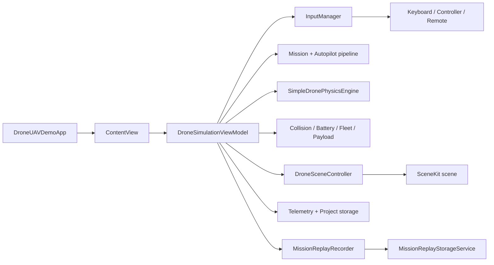

<h1 align="center"> UAVsim </a> 
<h3 align="center"> UAV flight simulator </h3>

# DroneUAVDemo: структура проекта и карта компонентов

## Назначение проекта

`DroneUAVDemo` — macOS-приложение на `Swift`, `SwiftUI` и `SceneKit` для симуляции БЛА. В одном target собраны:

- интерактивная 3D-сцена с окружением, камерами и полезной нагрузкой;
- baseline-физика полёта для мультикоптеров и самолётных БЛА;
- каталог БЛА, фильтры, настройка профиля и payload capability;
- mission planning, execution, safety/failsafe, debrief и replay;
- CAD/design workshop для сборки и просмотра конструктивных элементов;
- input-pipeline для клавиатуры, game controller, remote-control и будущего autopilot-provider;
- сохранение проектов, телеметрии, replay-сессий и экспорт видео replay.

Документ служит практической картой кодовой базы: где искать нужный слой, через какие файлы проходит runtime-поток и какие компоненты менять для типовых задач.

---

## Дорожная карта

Если нужно быстро понять проект, читайте в таком порядке:

1. [DroneUAVDemoApp.swift](DroneUAVDemoApp.swift)
   Точка входа macOS-приложения, `WindowGroup`, fullscreen command.
2. [ContentView.swift](Presentation/Views/ContentView.swift)
   Верхнеуровневый shell: стартовый экран, рабочая симуляция, replay center и CAD workspace.
3. [DroneSimulationViewModel.swift](Presentation/ViewModels/DroneSimulationViewModel.swift)
   Главный runtime-orchestrator: состояние, цикл симуляции, UI-команды, сцена, физика, миссии, input и storage.
4. [DroneSceneController.swift](Scene/DroneSceneController.swift)
   Управляет `SceneKit`-сценой, камерами, окружением, визуалом БЛА, payload и debug-слоями.
5. [SimpleDronePhysicsEngine.swift](Simulation/SimpleDronePhysicsEngine.swift)
   Основная baseline-физика полёта.
6. [MissionPlanBuilder.swift](Simulation/MissionPlanBuilder.swift), [MissionExecutionCoordinator.swift](Simulation/MissionExecutionCoordinator.swift), [MissionProgressTracker.swift](Simulation/MissionProgressTracker.swift)
   Планирование и выполнение миссий.
7. [CADWorkshopViewModel.swift](Presentation/ViewModels/CADWorkshopViewModel.swift)
   Orchestration CAD/design workshop: документ, инструменты эскиза, extrude/cut, selection и preview state.
8. [ReplayCenterView.swift](Presentation/Views/ReplayCenterView.swift)
   Просмотр replay, timeline, события, сравнение, trim и экспорт видео.

---

## Общая архитектура

Проект разбит на слои:

- `Presentation`
  SwiftUI-интерфейс, стартовый экран, toolstrip, модульная боковая панель, CAD workspace, replay UI и overlay-компоненты.
- `Presentation/ViewModels`
  Runtime state и orchestration для симуляции, CAD, replay library, биндов и compass.
- `Scene`
  Построение и обновление `SceneKit`-сцены симуляции, replay-сцены и CAD preview.
- `Simulation`
  Физика, автопилоты, маршруты, миссии, safety/failsafe, replay recorder/player, telemetry series и tactical map coordination.
- `Domain`
  Чистые модели данных: БЛА, миссии, payload, replay, карта, телеметрия, routing authority, CAD domain.
- `Services`
  Project storage, telemetry export, replay storage/settings и video export.
- `Input`
  Единый input-pipeline: keyboard, controller, remote, autopilot placeholder, бинды и настройки контроллера.
- `Remote`
  TCP remote-control transport, packet decoder и mock-транспорт.
- `Resources`
  Локализация и `Assets.xcassets`.

---

## Runtime data flow

1. `DroneUAVDemoApp` открывает `ContentView`.
2. `ContentView` показывает стартовый экран, CAD workspace или рабочую симуляцию.
3. `DroneSimulationViewModel` создаёт runtime-сервисы, input providers, scene controller и mission/replay pipeline.
4. На каждом тике `ViewModel` собирает input, mission/autopilot authority, payload, weather, collision и battery context.
5. `SimpleDronePhysicsEngine` обновляет `DroneState`.
6. `DroneSceneController` синхронизирует `SCNNode`-дерево, камеры, окружение, payload lifecycle и debug visuals.
7. Mission/replay/telemetry-сервисы записывают события, кадры, отчёты и экспортируемые данные.
8. SwiftUI-панели получают опубликованное состояние через `@Published` поля `ViewModel`.

Упрощённая схема:

---

## Корень проекта

### `/DroneUAVDemo`

- [DroneUAVDemoApp.swift](DroneUAVDemoApp.swift)
  Entry point приложения, размер окна, fullscreen-команда.

В соседнем [DroneUAVDemo.xcodeproj](../DroneUAVDemo.xcodeproj/project.pbxproj) лежит Xcode project target.

---

## Presentation

### `/Presentation/ViewModels`

- [DroneSimulationViewModel.swift](Presentation/ViewModels/DroneSimulationViewModel.swift)
  Главный runtime-viewmodel симуляции. Здесь сходятся UI, физика, сцена, input, миссии, payload, replay recorder, storage и diagnostics.
- [CADWorkshopViewModel.swift](Presentation/ViewModels/CADWorkshopViewModel.swift)
  Состояние design workshop: document model, selection, sketch tools, constraints, snaps, extrude/cut preview и commit.
- [ReplayLibraryViewModel.swift](Presentation/ViewModels/ReplayLibraryViewModel.swift)
  Список replay-записей, retention policy, загрузка и удаление replay.
- [BindingsViewModel.swift](Presentation/ViewModels/BindingsViewModel.swift)
  UI-состояние для настройки key bindings.
- [CompassViewModel.swift](Presentation/ViewModels/CompassViewModel.swift)
  Подготовка данных для compass overlay.

### `/Presentation/Views`

#### Shell и рабочие области

- [ContentView.swift](Presentation/Views/ContentView.swift)
  Главный shell. Содержит стартовый экран проектов, запуск replay center, переключение в CAD workspace и рабочую симуляцию.
- [SceneViewportView.swift](Presentation/Views/SceneViewportView.swift)
  Центральный viewport симуляции с `DroneSceneViewRepresentable`, HUD, tactical map и overlays.
- [DroneSceneViewRepresentable.swift](Presentation/Views/DroneSceneViewRepresentable.swift)
  Мост SwiftUI -> `SCNView`; подключает `DroneSceneController`, camera control и render delegate.
- [SidebarModuleHostView.swift](Presentation/Views/SidebarModuleHostView.swift)
  Host левой панели, отображает активный control module.
- [ControlModule.swift](Presentation/Views/ControlModule.swift)
  Enum модулей боковой панели: `flightOps`, `uavCatalog`, `camera`, `scenario`, `diagnostics`.

#### Модули симуляции

- [FlightOpsModuleView.swift](Presentation/Views/FlightOpsModuleView.swift)
  Arm/disarm, takeoff/land/return, режимы управления, автопуть и fixed-wing controls.
- [UAVCatalogModuleView.swift](Presentation/Views/UAVCatalogModuleView.swift), [UAVCatalogView.swift](Presentation/Views/UAVCatalogView.swift), [UAVFilterBarView.swift](Presentation/Views/UAVFilterBarView.swift), [UAVProfileCardView.swift](Presentation/Views/UAVProfileCardView.swift)
  Каталог БЛА, фильтры, карточки и выбор активного профиля.
- [CameraModuleView.swift](Presentation/Views/CameraModuleView.swift)
  Пресеты камеры, optics, follow/free camera и advanced controls.
- [ScenarioModuleView.swift](Presentation/Views/ScenarioModuleView.swift)
  Погода, ветер, terrain/map настройки и visibility/debug параметры сценария.
- [DiagnosticsModuleView.swift](Presentation/Views/DiagnosticsModuleView.swift), [TelemetryPanelView.swift](Presentation/Views/TelemetryPanelView.swift)
  Runtime-диагностика, телеметрия, fleet/service panels.
- [PayloadView.swift](Presentation/Views/PayloadView.swift), [PayloadToolbarEntry.swift](Presentation/Views/PayloadToolbarEntry.swift)
  Payload configuration, mount state, payload camera и toolbar entry.

#### Mission UI

- [MissionDraftPanel.swift](Presentation/Views/MissionDraftPanel.swift)
  Создание draft-миссии, waypoints, constraints и launch settings.
- [MissionMapView.swift](Presentation/Views/MissionMapView.swift), [TacticalMapView.swift](Presentation/Views/TacticalMapView.swift), [TacticalMapHostView.swift](Presentation/Views/TacticalMapHostView.swift)
  Планирование и отображение карты/маршрутов.
- [MissionTimelineView.swift](Presentation/Views/MissionTimelineView.swift), [MissionStatusPanel.swift](Presentation/Views/MissionStatusPanel.swift), [MissionSafetyPanel.swift](Presentation/Views/MissionSafetyPanel.swift)
  Progress, status и safety state миссии.
- [MissionDebriefView.swift](Presentation/Views/MissionDebriefView.swift), [MissionFailureView.swift](Presentation/Views/MissionFailureView.swift), [MissionEventFilterBar.swift](Presentation/Views/MissionEventFilterBar.swift)
  Итоги миссии, failure state и фильтрация событий.

#### Replay UI

- [ReplayCenterView.swift](Presentation/Views/ReplayCenterView.swift)
  Библиотека replay, playback, timeline, события, trim, сравнение и video export settings.
- [ReplayCenterWindowHost.swift](Presentation/Views/ReplayCenterWindowHost.swift)
  Открытие replay center в отдельном окне.
- [MissionReplaySceneViewRepresentable.swift](Presentation/Views/MissionReplaySceneViewRepresentable.swift)
  SwiftUI-мост для replay-сцены.
- [ReplayTimelineEditorView.swift](Presentation/Views/ReplayTimelineEditorView.swift)
  Timeline/trim UI и telemetry graphs.
- [FullscreenReplayViewerView.swift](Presentation/Views/FullscreenReplayViewerView.swift)
  Полноэкранный просмотр replay.

#### CAD/design workshop UI

- [CADWorkshopModuleView.swift](Presentation/Views/CADWorkshopModuleView.swift)
  Входной модуль design workshop.
- [DesignWorkshopWorkspaceView.swift](Presentation/Views/DesignWorkshopWorkspaceView.swift)
  Основная CAD workspace-компоновка: browser, properties, tool controls и viewport.

#### Input и overlays

- [KeyBindingsSettingsView.swift](Presentation/Views/KeyBindingsSettingsView.swift)
  Настройка клавиатурных биндов.
- [ControllerHubOverlay.swift](Presentation/Views/ControllerHubOverlay.swift), [ControllerCursorOverlay.swift](Presentation/Views/ControllerCursorOverlay.swift), [VirtualKeyboardView.swift](Presentation/Views/VirtualKeyboardView.swift)
  Game-controller UI, курсор и виртуальная клавиатура.
- [CompactTelemetryHUDView.swift](Presentation/Views/CompactTelemetryHUDView.swift), [CompassOverlayView.swift](Presentation/Views/CompassOverlayView.swift)
  HUD-компоненты поверх сцены.
- [ControlPanelView.swift](Presentation/Views/ControlPanelView.swift)
  Legacy/compatibility панель. Основная актуальная навигация идёт через `ControlModule` и `SidebarModuleHostView`.

---

## Domain

### `/Domain`

Чистые модели предметной области без прямого управления SwiftUI-сценой.

#### БЛА и каталог

- [DroneModelProfile.swift](Domain/DroneModelProfile.swift)
  Runtime flight/visual profile, `AbstractDroneParameters`, repository baseline-профилей.
- [UAVProfile.swift](Domain/UAVProfile.swift), [UAVReferenceCatalog.swift](Domain/UAVReferenceCatalog.swift), [UAVCatalog.swift](Domain/UAVCatalog.swift)
  Reference-профили, каталог и entries.
- [UAVVehicleType.swift](Domain/UAVVehicleType.swift), [UAVMassCategory.swift](Domain/UAVMassCategory.swift), [UAVDimensions.swift](Domain/UAVDimensions.swift), [UAVFlightTuningProfile.swift](Domain/UAVFlightTuningProfile.swift)
  Типы, размеры, масса и tuning.
- [UAVFilterState.swift](Domain/UAVFilterState.swift), [UAVSelectionState.swift](Domain/UAVSelectionState.swift)
  Состояние фильтрации и выбора.

#### Полёт, управление и authority

- [DroneState.swift](Domain/DroneState.swift), [DroneControlInput.swift](Domain/DroneControlInput.swift), [DroneControlValues.swift](Domain/DroneControlValues.swift), [DroneFlightMode.swift](Domain/DroneFlightMode.swift)
  Runtime state, control input и режимы полёта.
- [FlightControlRouting.swift](Domain/FlightControlRouting.swift), [MissionControlAuthorityState.swift](Domain/MissionControlAuthorityState.swift)
  Authority routing между manual, marker guidance, mission, failsafe и blocked states.
- [BatteryState.swift](Domain/BatteryState.swift), [DamageThermalModel.swift](Domain/DamageThermalModel.swift), [CollisionAnalysis.swift](Domain/CollisionAnalysis.swift), [TelemetrySnapshot.swift](Domain/TelemetrySnapshot.swift)
  Батарея, damage/thermal, collision snapshot и телеметрия.

#### Окружение и карта

- [WeatherModel.swift](Domain/WeatherModel.swift), [TerrainModel.swift](Domain/TerrainModel.swift)
  Погода, ветер, terrain presets и environment object kinds.
- [MapViewportState.swift](Domain/MapViewportState.swift), [TacticalMapMode.swift](Domain/TacticalMapMode.swift), [TacticalMapState.swift](Domain/TacticalMapState.swift)
  Tactical map viewport/modes/state.
- [TargetMarkerState.swift](Domain/TargetMarkerState.swift)
  Marker target для навигации.

#### Payload

- [PayloadConfiguration.swift](Domain/PayloadConfiguration.swift), [PayloadType.swift](Domain/PayloadType.swift), [PayloadState.swift](Domain/PayloadState.swift)
  Конфигурация и runtime-состояние полезной нагрузки.
- [PayloadMountState.swift](Domain/PayloadMountState.swift), [PayloadCapabilityCheck.swift](Domain/PayloadCapabilityCheck.swift), [PayloadDataQualitySource.swift](Domain/PayloadDataQualitySource.swift), [PayloadVisualPreset.swift](Domain/PayloadVisualPreset.swift)
  Mount/capability/data quality/visual preset.
- [VehicleMassModel.swift](Domain/VehicleMassModel.swift), [PayloadCameraController.swift](Domain/PayloadCameraController.swift)
  Итоговая масса и lifecycle payload camera.

#### Mission domain

- [MissionDraft.swift](Domain/MissionDraft.swift), [MissionDraftStatus.swift](Domain/MissionDraftStatus.swift), [MissionPlanningState.swift](Domain/MissionPlanningState.swift)
  Draft-миссия, validation status и planning UI state.
- [MissionPlan.swift](Domain/MissionPlan.swift), [MissionLeg.swift](Domain/MissionLeg.swift), [MissionWaypoint.swift](Domain/MissionWaypoint.swift), [MissionPreviewRoute.swift](Domain/MissionPreviewRoute.swift), [MissionTarget.swift](Domain/MissionTarget.swift)
  План, legs, waypoints, preview route и targets.
- [MissionExecutionState.swift](Domain/MissionExecutionState.swift), [MissionExecutionBindingState.swift](Domain/MissionExecutionBindingState.swift), [MissionWaypointProgress.swift](Domain/MissionWaypointProgress.swift)
  Runtime execution и progress.
- [MissionSafetyState.swift](Domain/MissionSafetyState.swift), [MissionRuntimeConstraintState.swift](Domain/MissionRuntimeConstraintState.swift), [MissionConstraints.swift](Domain/MissionConstraints.swift), [MissionZone.swift](Domain/MissionZone.swift)
  Safety, constraints и зоны.
- [MissionEvent.swift](Domain/MissionEvent.swift), [MissionWarning.swift](Domain/MissionWarning.swift), [MissionStatusSnapshot.swift](Domain/MissionStatusSnapshot.swift), [MissionStatusExplanation.swift](Domain/MissionStatusExplanation.swift)
  События, предупреждения и объяснения статусов.
- [MissionDebrief.swift](Domain/MissionDebrief.swift), [MissionReport.swift](Domain/MissionReport.swift), [MissionOutcome.swift](Domain/MissionOutcome.swift), [MissionFailureReason.swift](Domain/MissionFailureReason.swift), [MissionTruthStatus.swift](Domain/MissionTruthStatus.swift)
  Итоги, отчёты и результат миссии.

#### Replay domain

- [MissionReplaySession.swift](Domain/MissionReplaySession.swift), [MissionReplayFrame.swift](Domain/MissionReplayFrame.swift), [MissionReplayEvent.swift](Domain/MissionReplayEvent.swift), [MissionReplayRecordSummary.swift](Domain/MissionReplayRecordSummary.swift)
  Replay session, frames, events и summary.
- [MissionReplayContextSnapshot.swift](Domain/MissionReplayContextSnapshot.swift), [MissionReplayRetentionPolicy.swift](Domain/MissionReplayRetentionPolicy.swift)
  Контекст записи и retention.
- [ReplayCameraMode.swift](Domain/ReplayCameraMode.swift), [ReplayTrimRange.swift](Domain/ReplayTrimRange.swift), [ReplayComparisonResult.swift](Domain/ReplayComparisonResult.swift)
  Камеры replay, trim и сравнение.
- [ReplayVideoExportSettings.swift](Domain/ReplayVideoExportSettings.swift), [ReplayVideoExportMode.swift](Domain/ReplayVideoExportMode.swift), [ReplayExportResolutionPreset.swift](Domain/ReplayExportResolutionPreset.swift), [ReplayExportBitratePreset.swift](Domain/ReplayExportBitratePreset.swift)
  Настройки экспорта видео.

### `/Domain/CAD`

CAD/design domain не зависит от `SceneKit` напрямую.

- [DesignDocument.swift](Domain/CAD/DesignDocument.swift)
  CAD-документ, units, assets и selected asset.
- [DesignAsset.swift](Domain/CAD/DesignAsset.swift), [DesignAssetKind.swift](Domain/CAD/DesignAssetKind.swift)
  Активы: wing, frame plate, beam, tube, bracket, payload box, sketch2D, extruded solid.
- [AttachmentPoint.swift](Domain/CAD/AttachmentPoint.swift), [DesignTransform.swift](Domain/CAD/DesignTransform.swift), [DesignAssemblyLink.swift](Domain/CAD/DesignAssemblyLink.swift)
  Координаты, attachment points, transforms и связи сборки.
- [DesignMaterial.swift](Domain/CAD/DesignMaterial.swift), [DesignMassProperties.swift](Domain/CAD/DesignMassProperties.swift)
  Материалы и mass properties.
- [DesignSketchProfileGraph.swift](Domain/CAD/DesignSketchProfileGraph.swift)
  Поиск/описание профилей эскиза.
- [CADFeatureTypes.swift](Domain/CAD/CADFeatureTypes.swift)
  Типы feature operation, extrude/cut records, mesh snapshot/diagnostics и preview state.
- [CADSolidBackend.swift](Domain/CAD/CADSolidBackend.swift)
  Solid backend foundation: volume operations, validation, bounds, mesh cache и evaluation report.

---

## Scene

### `/Scene`

- [DroneSceneController.swift](Scene/DroneSceneController.swift)
  Главный контроллер сцены симуляции: root scene, камеры, drone node, world bounds, environment, collision/path debug, payload lifecycle, support surfaces и mission visuals.
- [SceneFactory.swift](Scene/SceneFactory.swift)
  Базовая `SCNScene`: ground, lights, grid, axes, camera.
- [DroneModelBuilder.swift](Scene/DroneModelBuilder.swift), [UAVVisualFactory.swift](Scene/UAVVisualFactory.swift), [FPVCameraAnchor.swift](Scene/FPVCameraAnchor.swift)
  Сборка визуальной модели БЛА, anchors и visual presets.
- [PayloadVisualFactory.swift](Scene/PayloadVisualFactory.swift), [PayloadDropCameraController.swift](Scene/PayloadDropCameraController.swift)
  Визуал payload и camera target для сброса.
- [ScenePopulationService.swift](Scene/ScenePopulationService.swift)
  Генерация descriptor-ов окружения по terrain preset.
- [EnvironmentObjectFactory.swift](Scene/EnvironmentObjectFactory.swift), [EnvironmentProceduralVisualFactory.swift](Scene/EnvironmentProceduralVisualFactory.swift), [EnvironmentProceduralMaterials.swift](Scene/EnvironmentProceduralMaterials.swift)
  Procedural geometry/materials окружения: здания, крыши, дороги, деревья, объекты и distant belt.
- [MissionReplaySceneController.swift](Scene/MissionReplaySceneController.swift)
  Отдельная сцена для replay reconstruction и video export.

### `/Scene/CAD`

- [DesignPreviewSceneBuilder.swift](Scene/CAD/DesignPreviewSceneBuilder.swift)
  CAD preview scene, camera presets, snap candidates, grids, reference planes и viewport state.
- [DesignPreviewSceneViewRepresentable.swift](Scene/CAD/DesignPreviewSceneViewRepresentable.swift)
  SwiftUI -> `SCNView` мост для CAD canvas и mouse interaction.
- [DesignAssetNodeFactory.swift](Scene/CAD/DesignAssetNodeFactory.swift)
  Создание `SCNNode`/geometry для CAD assets, sketches, extruded solids, faces, attachment markers и kernel mesh.

---

## Simulation

### Физика, окружение и runtime

- [DronePhysicsEngine.swift](Simulation/DronePhysicsEngine.swift)
  Протокол физического движка.
- [SimpleDronePhysicsEngine.swift](Simulation/SimpleDronePhysicsEngine.swift)
  Baseline-физика: substeps, multirotor/fixed-wing ветки, thrust, drag, wind, rate control и ground rest behavior.
- [DroneSimulationContext.swift](Simulation/DroneSimulationContext.swift), [FlightBaselineResolver.swift](Simulation/FlightBaselineResolver.swift)
  Входной контекст физики и резолв flight baseline.
- [CollisionAnalysisService.swift](Simulation/CollisionAnalysisService.swift), [AutoPathPlannerService.swift](Simulation/AutoPathPlannerService.swift)
  Collision risk, nearest obstacle, pathfinding и replan.
- [BatteryThermalSimulationService.swift](Simulation/BatteryThermalSimulationService.swift)
  Расчёт разряда, нагрева и degradation.
- [DroneFleetManager.swift](Simulation/DroneFleetManager.swift)
  Wingmen/fleet state и inter-drone risk.
- [PayloadController.swift](Simulation/PayloadController.swift)
  Payload defaults, capability check и итоговая mass model.
- [TacticalMapCoordinator.swift](Simulation/TacticalMapCoordinator.swift)
  Синхронизация tactical map state с mission/runtime context.

### Autopilot и routes

- [AutoNavigationController.swift](Simulation/AutoNavigationController.swift)
  Marker navigation phases: takeoff/cruise/approach/hold и fixed-wing/multirotor directives.
- [MulticopterAutopilotController.swift](Simulation/MulticopterAutopilotController.swift)
  Низкоуровневые команды коптера к target position/yaw/throttle.
- [FixedWingAutopilot.swift](Simulation/FixedWingAutopilot.swift), [FixedWingAutopilotController.swift](Simulation/FixedWingAutopilotController.swift)
  Fixed-wing route follower, launch phases, lateral guidance и energy/airspeed/altitude control.
- [FixedWingAssistController.swift](Simulation/FixedWingAssistController.swift)
  Assisted-control для fixed-wing: heading/altitude hold, intercept geometry и fallback.
- [FixedWingFlyablePath.swift](Simulation/FixedWingFlyablePath.swift)
  Построение flyable route primitives.
- [MulticopterRouteBuilder.swift](Simulation/MulticopterRouteBuilder.swift), [FixedWingRouteBuilder.swift](Simulation/FixedWingRouteBuilder.swift)
  Сборка mission route под тип аппарата.

### Mission planning, execution и safety

- [MissionDraftBuilder.swift](Simulation/MissionDraftBuilder.swift), [MissionDraftValidator.swift](Simulation/MissionDraftValidator.swift)
  Создание и проверка draft-миссии.
- [MissionPreviewBuilder.swift](Simulation/MissionPreviewBuilder.swift), [MissionPlanBuilder.swift](Simulation/MissionPlanBuilder.swift), [MissionPlanValidator.swift](Simulation/MissionPlanValidator.swift)
  Preview route, план миссии и validation.
- [MissionExecutionBinder.swift](Simulation/MissionExecutionBinder.swift), [MissionExecutionCoordinator.swift](Simulation/MissionExecutionCoordinator.swift), [MissionProgressTracker.swift](Simulation/MissionProgressTracker.swift)
  Bind active target, start/pause/resume/abort и progress tracking.
- [MissionAutopilotAdapter.swift](Simulation/MissionAutopilotAdapter.swift), [MissionGuidanceTargetResolver.swift](Simulation/MissionGuidanceTargetResolver.swift)
  Связь mission target с marker/autopilot pipeline.
- [MissionAuthorityGuard.swift](Simulation/MissionAuthorityGuard.swift), [MissionRuntimeMonitor.swift](Simulation/MissionRuntimeMonitor.swift), [MissionSafetyEvaluator.swift](Simulation/MissionSafetyEvaluator.swift), [MissionFailsafeCoordinator.swift](Simulation/MissionFailsafeCoordinator.swift)
  Authority, runtime constraints, battery feasibility, no-fly/safety и failsafe transitions.
- [MissionStatusResolver.swift](Simulation/MissionStatusResolver.swift), [MissionEventRecorder.swift](Simulation/MissionEventRecorder.swift), [MissionEventMapper.swift](Simulation/MissionEventMapper.swift)
  Status explanation, event recording и маппинг событий.
- [MissionDebriefService.swift](Simulation/MissionDebriefService.swift), [MissionReportBuilder.swift](Simulation/MissionReportBuilder.swift), [MissionTimelineBuilder.swift](Simulation/MissionTimelineBuilder.swift)
  Итоги миссии, report и timeline.
- [MissionPersistenceAdapter.swift](Simulation/MissionPersistenceAdapter.swift)
  Преобразование mission state для project persistence.

### Replay runtime

- [MissionReplayRecorder.swift](Simulation/MissionReplayRecorder.swift)
  Запись кадров и событий миссии.
- [MissionReplayPlayer.swift](Simulation/MissionReplayPlayer.swift)
  Playback state, speed, seek и selected session.
- [ReplayTelemetrySeriesBuilder.swift](Simulation/ReplayTelemetrySeriesBuilder.swift)
  Данные для графиков replay telemetry.
- [ReplayComparisonBuilder.swift](Simulation/ReplayComparisonBuilder.swift)
  Сравнение replay/report метрик.
- [ReplayTrimmer.swift](Simulation/ReplayTrimmer.swift)
  Trim replay-сессии.

---

## Services

### `/Services`

- [TelemetryExportService.swift](Services/TelemetryExportService.swift)
  Файл содержит сразу несколько инфраструктурных типов:
  `InternalStorePaths`, `ProjectRecordSummary`, `ProjectSnapshot`, `ProjectStorageManaging`, `ProjectStorageService`, `TelemetryExporting`, `TelemetryExportService`.
- [MissionReplayStorageService.swift](Services/MissionReplayStorageService.swift)
  Сохранение, загрузка, удаление replay-сессий, отчётов и summaries.
- [MissionReplaySettingsStore.swift](Services/MissionReplaySettingsStore.swift)
  Retention/settings для replay center.
- [ReplayVideoExportService.swift](Services/ReplayVideoExportService.swift)
  Экспорт replay в видео через `AVFoundation` и `SCNRenderer`.

### Internal store

`InternalStorePaths` размещает данные в `Application Support/DroneUAVDemo/InternalStore`. Основные зоны:

- `Projects`
- `Autosaves`
- `Telemetry`
- `Replays`
- `Index`

---

## Input

### `/Input`

- [InputManager.swift](Input/InputManager.swift)
  Центральный агрегатор input-pipeline: обновляет providers, выбирает dominant source, применяет smoothing/deadzone и объединяет action commands.
- [KeyboardInputService.swift](Input/KeyboardInputService.swift)
  Сервис клавиатуры, default bindings, categories, commands и action mapping.
- [KeyboardInputProvider.swift](Input/KeyboardInputProvider.swift)
  Adapter клавиатуры к `InputProvider`.
- [GameControllerInputProvider.swift](Input/GameControllerInputProvider.swift)
  GameController.framework integration, стики/кнопки, controller summary и right-stick mode.
- [RemoteInputProvider.swift](Input/RemoteInputProvider.swift)
  Adapter remote packets к `InputSnapshot`.
- [AutopilotInputProvider.swift](Input/AutopilotInputProvider.swift)
  Placeholder для будущей подачи autopilot directives через общий pipeline.
- [InputSnapshot.swift](Input/InputSnapshot.swift), [ResolvedControlState.swift](Input/ResolvedControlState.swift), [InputProvider.swift](Input/InputProvider.swift), [InputSourceKind.swift](Input/InputSourceKind.swift)
  Общие типы input-pipeline.
- [InputBindingsStore.swift](Input/InputBindingsStore.swift), [ControllerSettingsStore.swift](Input/ControllerSettingsStore.swift), [InputCaptureCoordinator.swift](Input/InputCaptureCoordinator.swift)
  Persistence и UI-настройка биндов/controller behavior.

---

## Remote

### `/Remote`

- [RemoteTransport.swift](Remote/RemoteTransport.swift)
  Протокол транспорта с packet/disconnect handlers.
- [NetworkRemoteHost.swift](Remote/NetworkRemoteHost.swift)
  TCP listener на `Network.framework`, по умолчанию порт `7777`.
- [RemotePacketDecoder.swift](Remote/RemotePacketDecoder.swift)
  Буферизация bytes и выделение `RemoteControlPacket`.
- [RemoteControlPacket.swift](Remote/RemoteControlPacket.swift)
  Wire-format remote-control пакета.
- [MockRemoteTransport.swift](Remote/MockRemoteTransport.swift)
  Локальный/mock transport без network listener.

---

## Resources

### `/Resources`

- [Resources/en.lproj/Localizable.strings](Resources/en.lproj/Localizable.strings)
  Английская локализация.
- [Resources/ru.lproj/Localizable.strings](Resources/ru.lproj/Localizable.strings)
  Русская локализация.
- [Resources/Assets.xcassets](Resources/Assets.xcassets/Contents.json)
  App icons и asset catalog.

---

## Как работает цикл симуляции

`DroneSimulationViewModel.startSimulationLoop()` запускает `Timer` с частотой `1/45` секунды. Каждый кадр проходит через `tick()`.

Упрощённый порядок:

1. снять `dt`;
2. обработать input и controller UI state;
3. обновить mission/autopilot targets и authority;
4. пересчитать pre-physics collision risk;
5. собрать `DroneControlInput` и `DroneSimulationContext`;
6. выполнить `physicsEngine.step(...)`;
7. применить runtime safety, signal loss, collision aftermath и state transitions;
8. обновить battery/thermal/fleet/payload context;
9. пересчитать post-physics collision risk;
10. обновить `DroneSceneController`;
11. записать mission events/replay frames, telemetry и diagnostics;
12. выполнить autosave/export накопления при необходимости.

Если нужно понять поведение дрона, начинать почти всегда стоит с `tick()` в [DroneSimulationViewModel.swift](Presentation/ViewModels/DroneSimulationViewModel.swift).

---

## Как устроен UI

Актуальная симуляционная компоновка — toolbar-driven modules.

- Верхняя панель `SimulationToolstripView` в [ContentView.swift](Presentation/Views/ContentView.swift) переключает `ControlModule`.
- Левая панель [SidebarModuleHostView.swift](Presentation/Views/SidebarModuleHostView.swift) показывает активный модуль.
- Payload открывается отдельным overlay через [PayloadView.swift](Presentation/Views/PayloadView.swift).
- Replay center открывается в отдельном окне через [ReplayCenterWindowHost.swift](Presentation/Views/ReplayCenterWindowHost.swift).
- CAD workspace переключает shell в `designWorkshop` и работает через [DesignWorkshopWorkspaceView.swift](Presentation/Views/DesignWorkshopWorkspaceView.swift).

SwiftUI не управляет `SceneKit` напрямую. UI вызывает методы `ViewModel`, а `ViewModel` обновляет `DroneSceneController` на тике.

---

## Как работает CAD/design workshop

1. [CADWorkshopViewModel.swift](Presentation/ViewModels/CADWorkshopViewModel.swift) хранит `DesignDocument`, selection, active tool, sketch state и feature preview.
2. [DesignWorkshopWorkspaceView.swift](Presentation/Views/DesignWorkshopWorkspaceView.swift) строит рабочее место CAD.
3. [DesignPreviewSceneViewRepresentable.swift](Scene/CAD/DesignPreviewSceneViewRepresentable.swift) передаёт pointer/canvas события в CAD view model.
4. [DesignPreviewSceneBuilder.swift](Scene/CAD/DesignPreviewSceneBuilder.swift) строит CAD scene, grid, planes, snap candidates и camera.
5. [DesignAssetNodeFactory.swift](Scene/CAD/DesignAssetNodeFactory.swift) превращает domain assets/sketches/solids в `SCNGeometry`.
6. [CADFeatureTypes.swift](Domain/CAD/CADFeatureTypes.swift) и [CADSolidBackend.swift](Domain/CAD/CADSolidBackend.swift) описывают extrude/cut validation, mesh snapshots и solid evaluation.

---

## Как работает mission/replay pipeline

1. Mission UI редактирует [MissionDraft.swift](Domain/MissionDraft.swift).
2. `MissionDraftBuilder` и `MissionDraftValidator` подготавливают draft/status.
3. `MissionPreviewBuilder` строит preview route, учитывая зоны и тип аппарата.
4. `MissionPlanBuilder` выбирает `MulticopterRouteBuilder` или `FixedWingRouteBuilder`.
5. `MissionExecutionBinder`, `MissionExecutionCoordinator`, `MissionProgressTracker` ведут runtime execution.
6. `MissionAutopilotAdapter` и `MissionGuidanceTargetResolver` связывают active target с autopilot/marker pipeline.
7. `MissionEventRecorder`, `MissionReplayRecorder`, `MissionReportBuilder` собирают события, кадры и отчёты.
8. `MissionReplayStorageService` сохраняет replay, а `ReplayCenterView` показывает playback, timeline, compare и export.

---

## Где менять что

- Логика взлёта/посадки/ручного управления:
  [DroneSimulationViewModel.swift](Presentation/ViewModels/DroneSimulationViewModel.swift), [SimpleDronePhysicsEngine.swift](Simulation/SimpleDronePhysicsEngine.swift), [FlightControlRouting.swift](Domain/FlightControlRouting.swift)
- Параметры и модели БЛА:
  [DroneModelProfile.swift](Domain/DroneModelProfile.swift), [UAVReferenceCatalog.swift](Domain/UAVReferenceCatalog.swift), [UAVFlightTuningProfile.swift](Domain/UAVFlightTuningProfile.swift)
- Каталог БЛА и фильтры:
  [UAVCatalogModuleView.swift](Presentation/Views/UAVCatalogModuleView.swift), [UAVCatalogView.swift](Presentation/Views/UAVCatalogView.swift), [UAVFilterState.swift](Domain/UAVFilterState.swift)
- Камеры симуляции:
  [CameraConfiguration.swift](Domain/CameraConfiguration.swift), [CameraModuleView.swift](Presentation/Views/CameraModuleView.swift), [DroneSceneController.swift](Scene/DroneSceneController.swift)
- Окружение и procedural visuals:
  [TerrainModel.swift](Domain/TerrainModel.swift), [ScenePopulationService.swift](Scene/ScenePopulationService.swift), [EnvironmentObjectFactory.swift](Scene/EnvironmentObjectFactory.swift), [EnvironmentProceduralVisualFactory.swift](Scene/EnvironmentProceduralVisualFactory.swift)
- Collision/pathfinding:
  [CollisionAnalysisService.swift](Simulation/CollisionAnalysisService.swift), [AutoPathPlannerService.swift](Simulation/AutoPathPlannerService.swift), [DroneSceneController.swift](Scene/DroneSceneController.swift)
- Коптерный автопилот:
  [MulticopterAutopilotController.swift](Simulation/MulticopterAutopilotController.swift), [AutoNavigationController.swift](Simulation/AutoNavigationController.swift), [MulticopterRouteBuilder.swift](Simulation/MulticopterRouteBuilder.swift)
- Самолётный автопилот:
  [FixedWingAutopilotController.swift](Simulation/FixedWingAutopilotController.swift), [FixedWingAssistController.swift](Simulation/FixedWingAssistController.swift), [FixedWingRouteBuilder.swift](Simulation/FixedWingRouteBuilder.swift), [FixedWingFlyablePath.swift](Simulation/FixedWingFlyablePath.swift)
- Mission execution/safety:
  [MissionExecutionCoordinator.swift](Simulation/MissionExecutionCoordinator.swift), [MissionProgressTracker.swift](Simulation/MissionProgressTracker.swift), [MissionSafetyEvaluator.swift](Simulation/MissionSafetyEvaluator.swift), [MissionFailsafeCoordinator.swift](Simulation/MissionFailsafeCoordinator.swift)
- Replay:
  [MissionReplayRecorder.swift](Simulation/MissionReplayRecorder.swift), [MissionReplayPlayer.swift](Simulation/MissionReplayPlayer.swift), [ReplayCenterView.swift](Presentation/Views/ReplayCenterView.swift), [MissionReplayStorageService.swift](Services/MissionReplayStorageService.swift), [ReplayVideoExportService.swift](Services/ReplayVideoExportService.swift)
- CAD/design workshop:
  [CADWorkshopViewModel.swift](Presentation/ViewModels/CADWorkshopViewModel.swift), [DesignWorkshopWorkspaceView.swift](Presentation/Views/DesignWorkshopWorkspaceView.swift), [DesignAssetKind.swift](Domain/CAD/DesignAssetKind.swift), [CADSolidBackend.swift](Domain/CAD/CADSolidBackend.swift), [DesignAssetNodeFactory.swift](Scene/CAD/DesignAssetNodeFactory.swift)
- Input/remote-control:
  [InputManager.swift](Input/InputManager.swift), [KeyboardInputService.swift](Input/KeyboardInputService.swift), [GameControllerInputProvider.swift](Input/GameControllerInputProvider.swift), [RemoteInputProvider.swift](Input/RemoteInputProvider.swift), [NetworkRemoteHost.swift](Remote/NetworkRemoteHost.swift)
- Payload:
  [PayloadController.swift](Simulation/PayloadController.swift), [PayloadView.swift](Presentation/Views/PayloadView.swift), [PayloadVisualFactory.swift](Scene/PayloadVisualFactory.swift), [PayloadCameraController.swift](Domain/PayloadCameraController.swift)
- Project storage / telemetry export:
  [TelemetryExportService.swift](Services/TelemetryExportService.swift)
- Локализация:
  [Resources/en.lproj/Localizable.strings](Resources/en.lproj/Localizable.strings), [Resources/ru.lproj/Localizable.strings](Resources/ru.lproj/Localizable.strings)

---

## Важные замечания

1. [DroneSimulationViewModel.swift](Presentation/ViewModels/DroneSimulationViewModel.swift) остаётся самым центральным и крупным файлом. Поведенческие изменения часто проходят через него.
2. [TelemetryExportService.swift](Services/TelemetryExportService.swift) содержит не только telemetry export, но и project storage types.
3. [CADWorkshopViewModel.swift](Presentation/ViewModels/CADWorkshopViewModel.swift) тоже крупный: tool-state, validation и commit logic сейчас живут рядом.
4. `SceneKit`-логику лучше держать в `Scene/*` и `Scene/CAD/*`, а SwiftUI использовать как слой ввода/отображения.
5. В рабочем дереве могут быть незакоммиченные изменения в CAD и локализации; перед крупными refactor-ами стоит сверять `git status`.

---

## Краткое резюме по слоям

- `DroneUAVDemoApp.swift`
  Запускает окно приложения.
- `Presentation/*`
  SwiftUI shell, модули, mission UI, replay UI, CAD workspace и overlays.
- `Presentation/ViewModels/*`
  Runtime orchestration для симуляции, CAD, replay library и настроек.
- `Scene/*`
  `SceneKit`-сцена симуляции, replay-сцена, CAD preview, procedural окружение и visuals.
- `Simulation/*`
  Физика, автопилоты, маршруты, миссии, safety, replay runtime, tactical map, battery/fleet/payload math.
- `Domain/*`
  Чистые модели данных для БЛА, миссий, payload, replay, карты, input authority и CAD.
- `Services/*`
  Project storage, telemetry export, replay storage/settings и video export.
- `Input/*`
  Keyboard/controller/remote/autopilot input pipeline, бинды и настройки контроллера.
- `Remote/*`
  TCP remote-control transport и packet decoder.
- `Resources/*`
  Локализация и системные ассеты.

Если нужен один файл для входа в runtime, начните с [DroneSimulationViewModel.swift](Presentation/ViewModels/DroneSimulationViewModel.swift). Если нужен вход в UI, начните с [ContentView.swift](Presentation/Views/ContentView.swift). Если нужен вход в сцену, начните с [DroneSceneController.swift](Scene/DroneSceneController.swift). Если нужен вход в CAD, начните с [CADWorkshopViewModel.swift](Presentation/ViewModels/CADWorkshopViewModel.swift).
